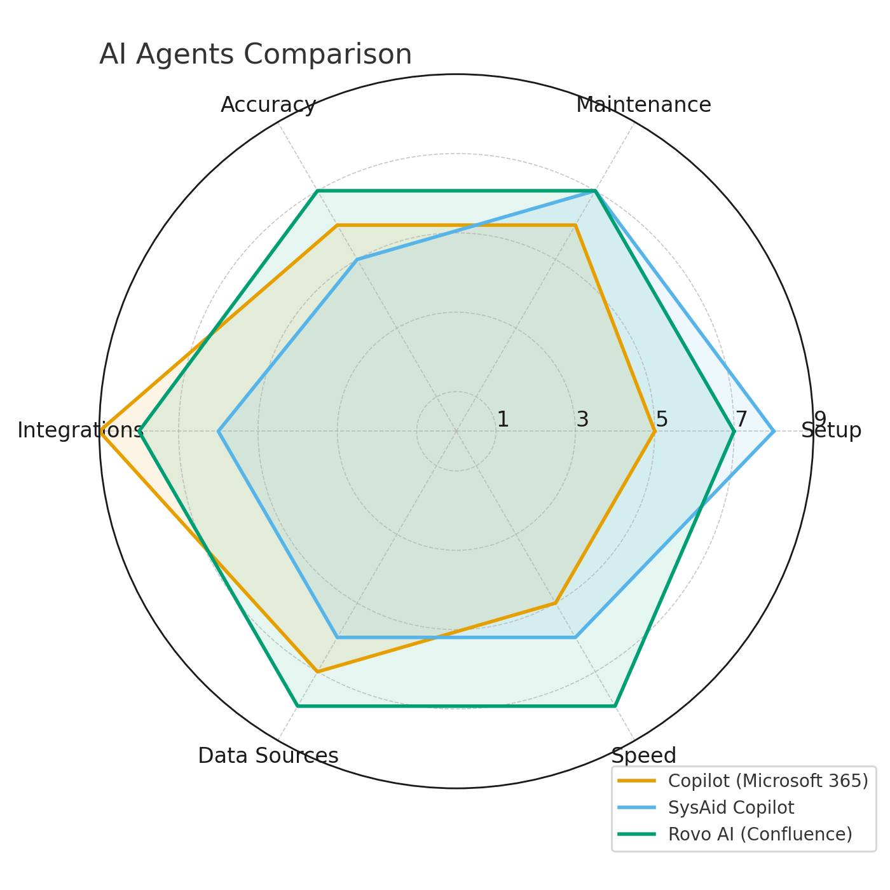

# Generate-Radio-Graph

## Overview

This project generates a **radar chart comparison of generative AI
tools** using Python and exports a **weighted evaluation table**.

The script evaluates tools across multiple operational categories and
produces:

-   A **radar chart visualization**
-   A **weighted comparison CSV**
-   A **simple, reproducible Python workflow**

The implementation intentionally uses **minimal dependencies** and
avoids styling libraries to keep the code portable.

------------------------------------------------------------------------

## Example Output

The script generates a radar chart similar to the following:

------------------------------------------------------------------------

## Evaluation Dimensions

Each AI system is scored on a **1--9 scale** across operational
criteria.

  Dimension      Description
  -------------- ----------------------------------------
  Setup          Ease of initial deployment
  Maintenance    Operational overhead
  Accuracy       Quality and correctness of responses
  Integrations   Ability to connect with external tools
  Data Sources   Breadth of accessible knowledge
  Speed          Response latency and throughput

------------------------------------------------------------------------

## Weighting Model

The radar chart displays **raw scores**, but the final evaluation uses
weighted totals.

  Category       Weight
  -------------- --------
  Setup          ×1
  Maintenance    ×1
  Accuracy       ×2
  Integrations   ×1
  Data Sources   ×2
  Speed          ×2

Maximum possible score = **100**

------------------------------------------------------------------------

## Weighted Results

  Tool                      Score
  ------------------------- --------
  Rovo AI (Confluence)      **68**
  Copilot (Microsoft 365)   **56**
  SysAid Copilot            **55**

Interpretation:

-   **Rovo AI** leads due to speed and strong knowledge access.
-   **Copilot** benefits from Microsoft ecosystem integration.
-   **SysAid Copilot** excels in ITSM simplicity but has narrower scope.

------------------------------------------------------------------------

## Python Implementation

The Python script generates both the **CSV comparison data** and the
**radar chart image**.

Main file:

    radar_chart.py

Key characteristics:

-   Uses **matplotlib only**
-   Generates **single radar chart**
-   Avoids seaborn or heavy visualization frameworks
-   Exports results to **CSV**

------------------------------------------------------------------------

## Running the Script

### Install dependencies

    pip install pandas matplotlib

### Run

    python radar_chart.py

Outputs generated:

    generative_ai_tools_radar.png
    generative_ai_tool_comparison_weighted.csv

------------------------------------------------------------------------

## Repository Structure

    ai-agent-comparison
    │
    ├─ radar_chart.py
    ├─ README.md
    ├─ generative_ai_tools_radar.png
    ├─ generative_ai_tool_comparison_weighted.csv

------------------------------------------------------------------------

## Design Principles

-   **KISS** -- Keep it Simple and Speedy

------------------------------------------------------------------------

## To Do List

-   Add other format outputs.
-   Turn this into a packaged module.
-   Extend the CLI to handle processing in parallel using workers and
    queues.

------------------------------------------------------------------------

## License

Copyright 2026

-   Wayne Kirk Schmidt (wayne.kirk.schmidt@gmail.com)

Licensed under the Apache 2.0 License (the "License"); you may not use
this file except in compliance with the License. You may obtain a copy
of the License at

license-name Apache 2.0\
license-url https://www.apache.org/licenses/LICENSE-2.0

Unless required by applicable law or agreed to in writing, software
distributed under the License is distributed on an "AS IS" BASIS,
WITHOUT WARRANTIES OR CONDITIONS OF ANY KIND, either express or implied.
See the License for the specific language governing permissions and
limitations under the License.

------------------------------------------------------------------------

## Support

Feel free to e-mail me with issues:

wayne.kirk.schmidt@gmail.com

I will provide **best effort fixes and extend the scripts**.
